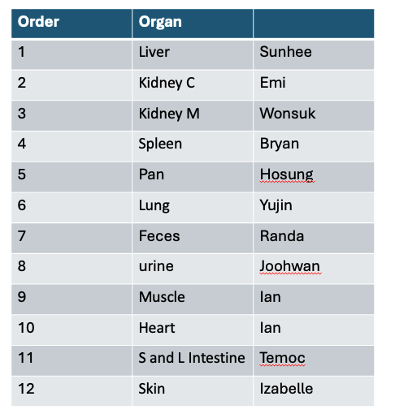

# LC-MS RT Evidence Collection Pipeline

This script extracts **high-confidence metabolite annotations** from Compound Discoverer (CD) outputs and prepares a standardized table for **retention time (RT) validation and library updating**.

⚠️ **Important:**  
This script does **NOT update the library**. It only collects evidence from your sequence. All updates will be done centrally.

---

## 📦 Step 1 — Download the Pipeline

1. Go to the GitHub repository webpage  
2. Click the green button **Code → Download ZIP**
3. Unzip the folder to a location on your computer

---

## 📁 Step 2 — Prepare Your Files

Inside the unzipped folder:

1. Check which tissue you have been assigned. Select Compound Discoverer exports from a sequence that you have found reliable (e.g. data that you eventually published are ideal)




2. Place your Compound Discoverer exports into the `my_input/` folder  
   - You must export your CD results as **.csv files** (not .xlsx)

Example:
```
my_input/
  ldlr_serum_posi.csv
  ldlr_serum_nega.csv
```

  - If your files are .xlsx, convert in R via:
```r
install.packages("readxl") #install if needed
library(readxl)

df <- read_excel("input.xlsx") # read Excel file

write.csv(df, "output.csv", row.names = FALSE) # write to CSV
```


2. Ensure the provided library file is present in the root directory: `metabolites_list_260210.csv`

---

## ⚙️ Step 3 — Open and Edit the Script

Open the script `01_match_libraries.R` in **RStudio** (recommended).

At the top of the script, edit the following fields:

```r
myname = "Ian"
mytissue = "Serum"           # e.g., Serum, Liver, Heart, etc.
seqdate  = "2022-04"         # approx date of sequence as YYYY-MM
seqname  = "ldlr_serum_apr2022" 
```

Update file paths for your CD filenames:
```r
cd_posi_path = "my_input/ldlr_serum_posi.csv"
cd_nega_path = "my_input/ldlr_serum_nega.csv"
```

---

## Step 4 — Run the Script and Generate Output

In RStudio, run all lines in the script

The script will generate a file:`myname_tissue_date.csv`
Example: `Ian_Serum_2023-04.csv.csv`

---

## Step 5 — Submit Your Output

Send the generated .csv file back to Ian

---

## What This Script Does
* Extracts annotated compounds from CD output
* Filters to higher-confidence matches:
  * removes blank/invalid names
  * keeps reasonable mass accuracy
  * prioritizes mzCloud-supported annotations
* Selects the best-supported annotation per compound (per ion mode)
* Merges with the current reference library
* Reports:
  * observed RT (RT.seq)
  * library RT (RT.library)
  * RT difference (RT.diff)
  * mzCloud match and confidence
  * sequence metadata (date, tissue, etc.)

## Important Notes

Do NOT modify the output file.
Do NOT attempt to update RTs manually.
Positive and negative mode data are handled separately.

## Troubleshooting

Issue: “File not found”

- Check that your .csv files are inside my_input/
- Make sure filenames match exactly

Issue: Script errors on column names

- Ensure your CD export includes the expected columns: *Name, Formula, m/z RT mzCloud match + confidence*

Issue: mzCloud confidence missing

- This is okay — those entries will be filtered automatically

### **Please don't hesitate to reach out to Ian with any other issues!**
...

...

...


